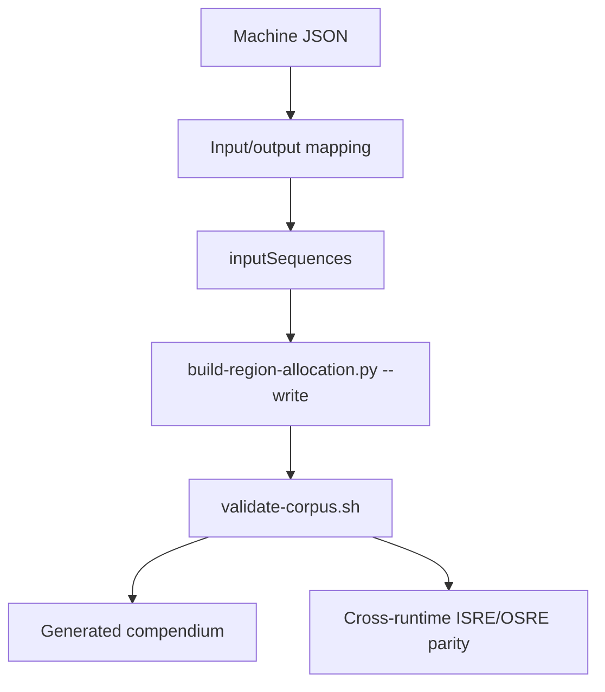

# Interconnected Machines Setup

Use this page as the short operational checklist for adding or validating
interconnected machines.

## Checklist

Adding a machine to an existing domain is a corpus change in
`RealityEngine_Machines`. Adding a *new* domain is governed by
`MACHINE_CONCEPT.md` §9, which is a gated acceptance process rather than a
checklist — follow §9.4 there instead of this page.

| Step | Action |
| --- | --- |
| 1 | Add machine JSON under `RealityEngine_Machines/machines/domains/<domain>/`. Filenames are globally unique across the corpus. |
| 2 | Define `perceptualMapping.input` and `perceptualMapping.output`. |
| 3 | Add `inputSequences` with expected-output metadata. |
| 4 | If output feeds another domain, intentionally overlap the downstream input region — and declare how the contended cell resolves, per `ARBITER_CONTRACT.md` §5. |
| 5 | Regenerate the allocation: `cd ../RealityEngine_Machines && python3 scripts/build-region-allocation.py --write`. |
| 6 | Run the gate: `bash scripts/validate-corpus.sh`. |
| 7 | Regenerate the wiki compendium: `node scripts/generate_example_machine_compendium.mjs` (from `RealityEngine_CI`). |
| 8 | Confirm ISRE/OSRE parity across runtimes with the domain present — a separate result from step 6, and one that must stay separate. |

## Visual Model

## Source Startup

At startup the Perception Engine creates test sources from machine
`inputSequences` so authored sequences can be replayed through the same PE -> RE
push path used by live sources.
